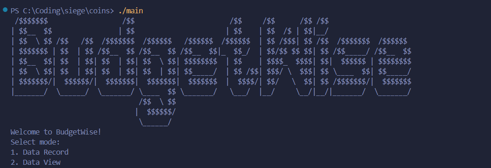

# BudgetWise - Budget Analyzer for Students



## What is BudgetWise?
Budgetwise is a terminal-based app made to give students a insight into their expenses and hopefully reduce unneccsary expenses. 

## How to run?
**Windows:**  
After cloning the repository, you should just need to `cd` into the directory and run `./BudgetWise` on Windows. 

**MacOS:**  
Clone the repository, generate a executable with ```chmod +x BudgetWise```, and run with `./BudgetWise` 

Once the program is running, add some expenses with mode 1 (Data Record) and then use Data View to see some stats about your expenses. 